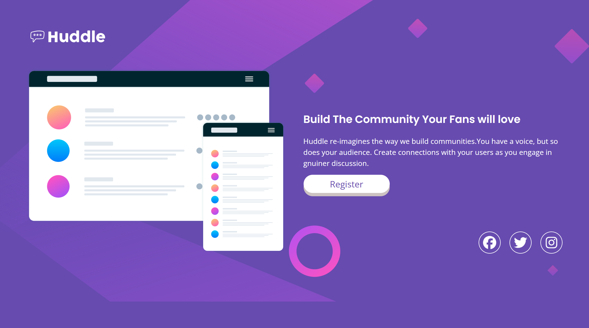

# Frontend Mentor - Huddle Landing Page with Single Introductory Section

This is my solution to the [Huddle landing page with single introductory section challenge on Frontend Mentor](https://www.frontendmentor.io/challenges/huddle-landing-page-with-a-single-introductory-section-B_2Wvxgi0).

## Table of Contents

- [Overview](#overview)
  - [The Challenge](#the-challenge)
  - [Screenshot](#screenshot)
  - [Links](#links)
- [My Process](#my-process)
  - [Built With](#built-with)
  - [What I Learned](#what-i-learned)
  - [Continued Development](#continued-development)
  - [Useful Resources](#useful-resources)
- [Author](#author)

---

## Overview

### The Challenge

Users should be able to:

- View the optimal layout for the page depending on their device's screen size
- See hover states for all interactive elements on the page

### Screenshot




### Links


- Live Site URL: [live site URL here](https://adorable-tartufo-e0034f.netlify.app/)

---

## My Process

### Built With

- Semantic HTML5 markup
- CSS custom properties (variables)
- Flexbox
- CSS Grid
- Mobile-first workflow
- Google Fonts (Poppins + Open Sans)
- Font Awesome icons

### What I Learned

**Background images with `background-repeat`**

I learned how to use SVG background images and control their repeat behaviour. For mobile I used `repeat-x` to tile the background horizontally, and on desktop I switched to `no-repeat` with `background-size: cover`:

```css
.background__image__div {
  background-image: url(./images/bg-mobile.svg);
  background-repeat: repeat-x;
}

@media (min-width: 768px) {
  .background__image__div {
    background-image: url(./images/bg-desktop.svg);
    background-repeat: no-repeat;
    background-size: cover;
  }
}
```

**3D Button Effect**

I built a 3D-style button using a wrapper element with a dark bottom edge and a front layer that shifts upward with `translateY`. Clicking it pushes the layer down to simulate a press:

```css
.btn {
  background-color: var(--clr-dark-edge);
  border-radius: 10rem;
  border: none;
}

.front-layer {
  display: block;
  background-color: var(--clr-bg-btn);
  border-radius: 10rem;
  padding: 0.3rem 3rem;
  transform: translateY(-6px);
}

.btn:active .front-layer {
  transform: translateY(-2px);
}
```

**`align-items` and `text-align` together**

I learned that to properly left-align content inside a flex column on desktop, both `align-items: start` and `text-align: start` need to be applied together. Using only one of them wasn't enough:

```css
@media (min-width: 768px) {
  .hero__description {
    align-items: start;
    text-align: start;
  }
}
```

**`drop-shadow` filter on social icons**

For the social link hover effect, I used `filter: drop-shadow()` instead of `box-shadow` — this works better with circular/icon elements and gives a glowing effect that follows the shape:

```css
.icon-section a:hover {
  filter: drop-shadow(1px 2px 8px var(--shadow-color));
  transform: scale(2);
  transition: transform 0.4s;
}
```

**Adding and Styling Font Awesome Icons**

I learned how to include Font Awesome icons via a kit script in the `<head>`, then use them as inline `<i>` elements with brand icon classes:

```html
<!-- Add the kit script in <head> -->
<script src="https://kit.fontawesome.com/5ea9af86c3.js" crossorigin="anonymous"></script>

<!-- Use icons with class names -->
<a><i class="fa-brands fa-facebook fa-xl"></i></a>
<a><i class="fa-brands fa-twitter fa-xl"></i></a>
<a><i class="fa-brands fa-instagram fa-xl"></i></a>
```

For styling, I discovered that Font Awesome icons inherit `color` from their parent element, so styling the wrapping `<a>` tag is enough — no need to target the `<i>` directly:

```css
/* Icons inherit color from the <a> tag */
.icon-section a {
  border: 1px solid white;
  border-radius: 50%;
  width: 40px;
  height: 40px;
  display: flex;
  justify-content: center;
  align-items: center;
}

.icon-section a:hover {
  border: 1px solid var(--clr-primary-magenta);
  color: var(--clr-primary-magenta); /* icon color changes on hover */
}
```

### Continued Development

In future projects I want to focus on:

- Becoming more comfortable with CSS Grid for complex layouts, particularly managing alignment across both axes
- Improving my understanding of when to use `filter: drop-shadow` vs `box-shadow`
- Practising more mobile-first breakpoint strategies so the desktop layout feels less like an afterthought

### Useful Resources

- [Kevin Powell on YouTube](https://www.youtube.com/@KevinPowell) — His videos on flexbox, CSS layout, and responsive design were super helpful throughout this project
- [Josh Comeau's Blog](https://www.joshwcomeau.com) — Great deep-dives into CSS fundamentals; his reset and interactive guides were very useful
- [CSS Tricks: background-repeat](https://css-tricks.com/almanac/properties/b/background-repeat/) — Helped me understand the different `background-repeat` values
- [Font Awesome](https://fontawesome.com) — Used for the social media icons

---

## Author

- Frontend Mentor — [@purvjadh](https://www.frontendmentor.io/profile/purvjadh)
- GitHub — [@purvjadh](https://github.com/purvjadh)